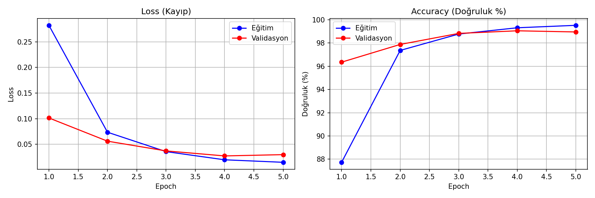
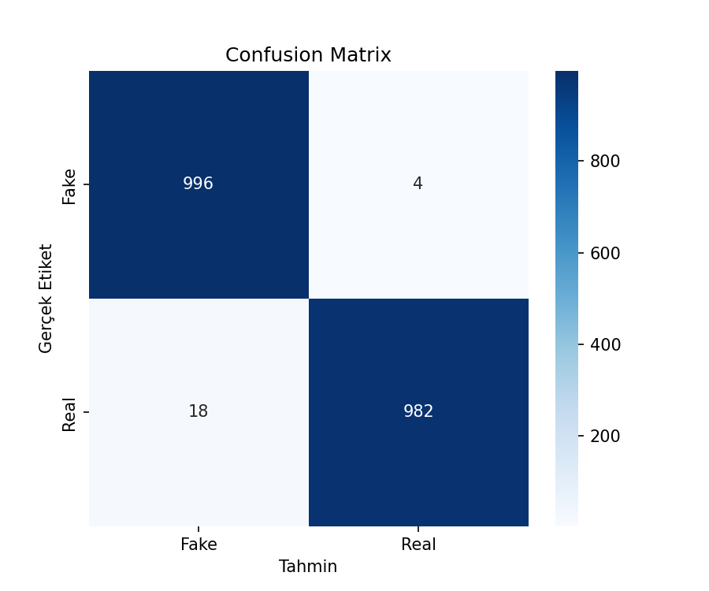
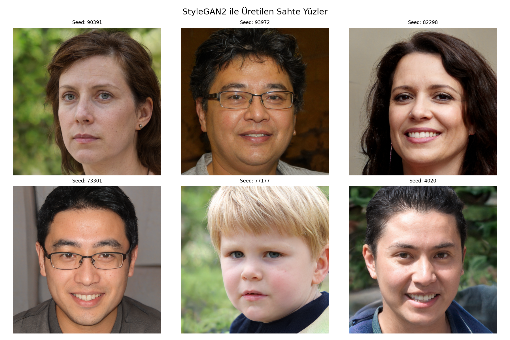

# 🎭 Deepfake Algılama ve Üretme Sistemi

Görüntü İşleme dersi proje ödevi — EfficientNet tabanlı deepfake tespit sistemi ve StyleGAN2 ile sahte yüz üretimi.

## 📊 Model Performansı
- Test doğruluğu: **%99**
- Precision: 0.98 | Recall: 1.00 | F1-Score: 0.99

## 🛠️ Kullanılan Teknolojiler
- **PyTorch** — Model eğitimi
- **EfficientNet-B0** — Transfer learning ile deepfake tespiti
- **StyleGAN2-ADA** — Fotorealistik sahte yüz üretimi
- **Gradio** — Demo arayüzü
- **Dataset:** 140k Real and Fake Faces (Kaggle)

## 🚀 Kurulum ve Çalıştırma
pip install torch torchvision gradio facenet-pytorch
python app.py

## 📁 Dosya Yapısı
- app.py — Gradio demo arayüzü
- deepfake_detector_v2.pth — Eğitilmiş model
- training_results.png — Eğitim grafikleri
- confusion_matrix.png — Confusion matrix
- generated_faces.png — StyleGAN2 üretim örnekleri

## 📈 Sonuçlar

